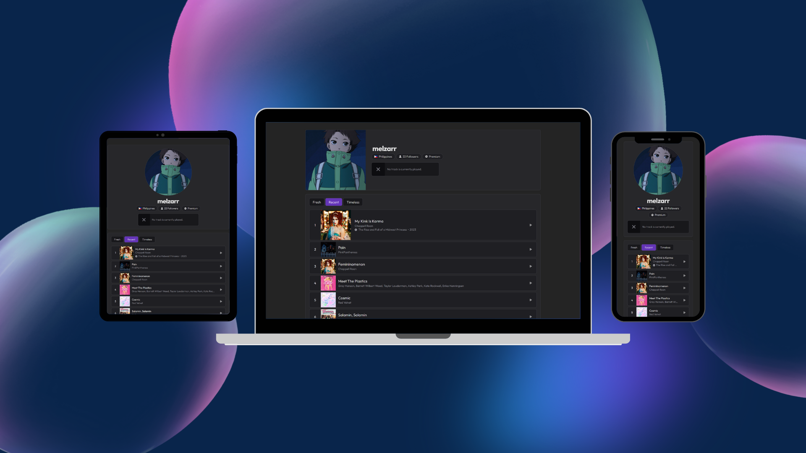

# My Spotify Stats

This is just a simple React + TS + Vite side project for showing my general profile details, currently played track, and top tracks in Spotify via their Web API.

More features might be coming soon (don't count on it lmao).

 

 ### 💻 Demo

 It's live at [melzarr-spotify-stats.vercel.app](https://melzarr-spotify-stats.vercel.app).
 
 Although, when you try to authorize your Spotify account to use it, it won't allow you since it's still in development mode. Still need to apply to Spotify to evaluate the app for a [quota extension](https://developer.spotify.com/documentation/web-api/concepts/quota-modes).

 If you really need to, just hmu [@melzarjanchico](melzarjanchico@gmail.com) to include you in the allowlist.

## Local Development

### 📝 Prerequisites
Ensure you have the following installed:
- Node.js (version 20.x or higher)
- npm (version 9.x or higher)

### 🔧 Getting Started
1. Clone and change directory to the repository
    ```bash
      git clone https://github.com/melzarjanchico/my-spotify-stats.git
      cd my-spotify-stats
    ```

2. Install packages
    ```bash
      # Shortened npm install in the package.json
      npm i
    ```

3. Type the following commands to explore:
    ```bash
      # To run dev environment
      npm run dev

      # To build
      npm run build

      # To run linter
      npm run lint
    ```

4. You should be able to open the app via `localhost` (type `localhost:5173` in your browser). However, it should not yet work since you need to set-up your `.env` variables.

5. Set the .env variables. Just make an `.env` file in the root and provide the following:
    ```env
      VITE_CLIENT_ID="<YOUR SPOTIFY APP CLIENT ID HERE>"
      VITE_CLIENT_SECRET="<YOUR SPOTIFY APP SECRET ID HERE>"
      VITE_URL="http://localhost:5173"
      VITE_NODE_ENV = "local"
    ```

      You can refer to [Spotify's Web API documentation](https://developer.spotify.com/documentation/web-api) to make your own client ID and Secret. You can also refer there the endpoints you'll need.

<!-- The yap in me is tremendous lmao -->
